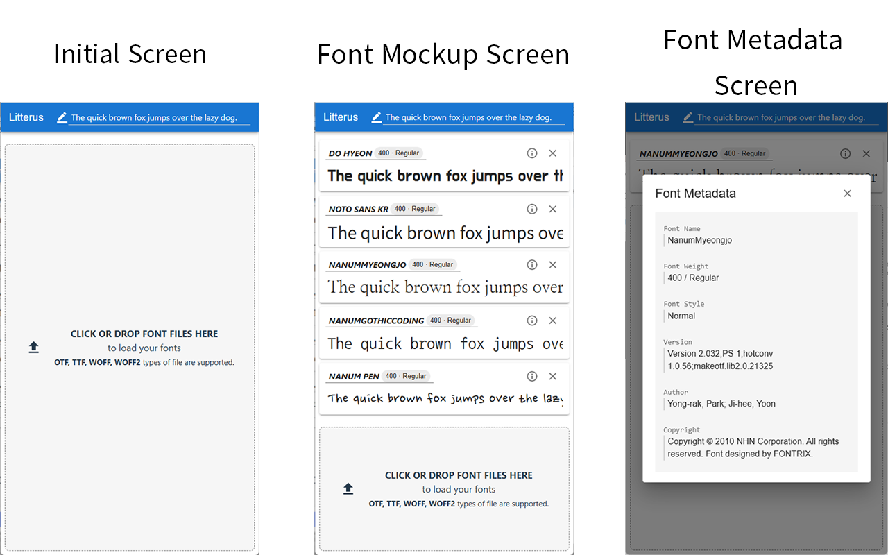

# LITTERUS
  https://dowol.github.io/litterus

## WHAT IS THE LITTERUS?
**Litterus** is an application for Typography assistance that makes your 
own fonts visually comparable. It helps to choose appropriate fonts for 
your design by easy controls. 

## FEATURES


### Typography Mockup
Upload your own font files, and visually compare them.  
`*.otf`, `*.ttf`, `*.woff`, `*.woff2` files are supported.

### Font Metadata Viewer
Click **ⓘ** button to view font metadata, such as Exact name, version, style, author.

## HOW TO USE
### Access directly
You may just enter to the [official web page](https://dowol.github.io/litterus)
by your preferred browser.

### Install on your own server
To run **Litterus** on your own server, follow these steps:

```bash
# 0. Log in to your server

# 1. Clone this repository
git clone https://github.com/dowol/litterus --depth 1

# 2. Move to repository directory
cd litterus

# 3. Install necessary npm packages
npm install 

# 4. Build the project and run server
npm run build

# 5. Configure your server (httpd or nginx)
```

### DEPENDENCIES
* [React](https://react.dev/)  
  Frontend library
* [Material UI](https://mui.com/)  
  UI components
* [Linkify](https://linkify.js.org/)  
  Detect URLs and convert to accessible hyperlink
* [OpenType.js](https://opentype.js.org/)  
  Font file parser
* [Sortable.js](https://sortablejs.github.io/)  
  Reorderable drag &amp; drop lists
* [Zustand](https://zustand-demo.pmnd.rs/)  
  Global state manager

## LICENSE 
**Litterus** is distributed under the GNU General Public License v3. 
Read [LICENSE.txt] files for details.